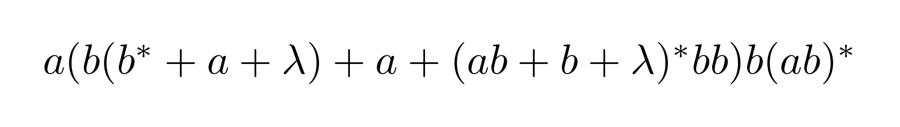
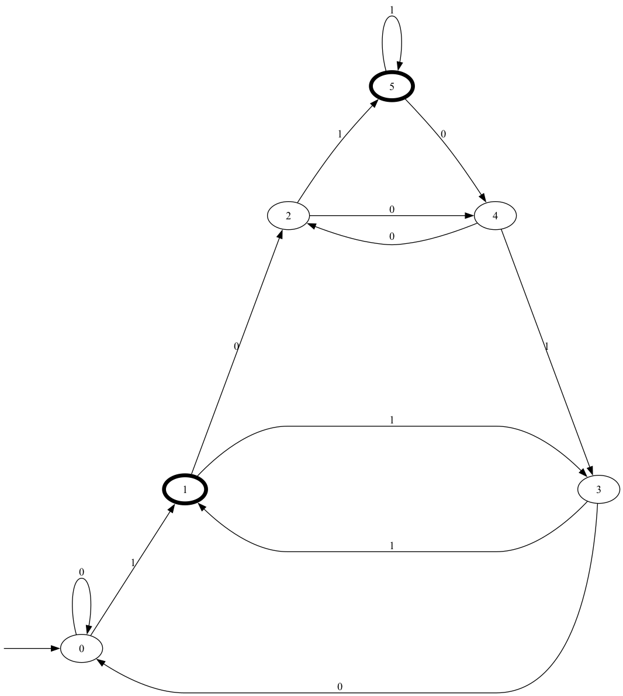

# Finite Automata

## Bidirectional Conversions Between:
 - expression string    (regular expression in human readable form)
 - regular expression   (regular expression in tree form)
 - λNFA                 (finite automata with λ edges)
 - reNFA                (λNFA where start state in-degree is zero and single accept state out-degree is zero)
 - NFA                  (finite automata without λ edges)
 - DFA                  (finite automata with no ambiguous edges)
 - min DFA              (DFA that perserves it language using the minimal number states)
 - dfa complement       (the DFA representing the complement of the original language)

## Examples

### Expression String to Regular Expression

"a (b (b* + a + λ) + λ(a + (ab + b + λ)* bb)) b(ab)*"

### Regular Expression to λNFA

### λNFA to NFA

### NFA to DFA

### DFA to Min DFA

### DFA to Regular Expression

### DFA to Complement

### Match N Mod M

N = { 1, 5 }, M = 6

